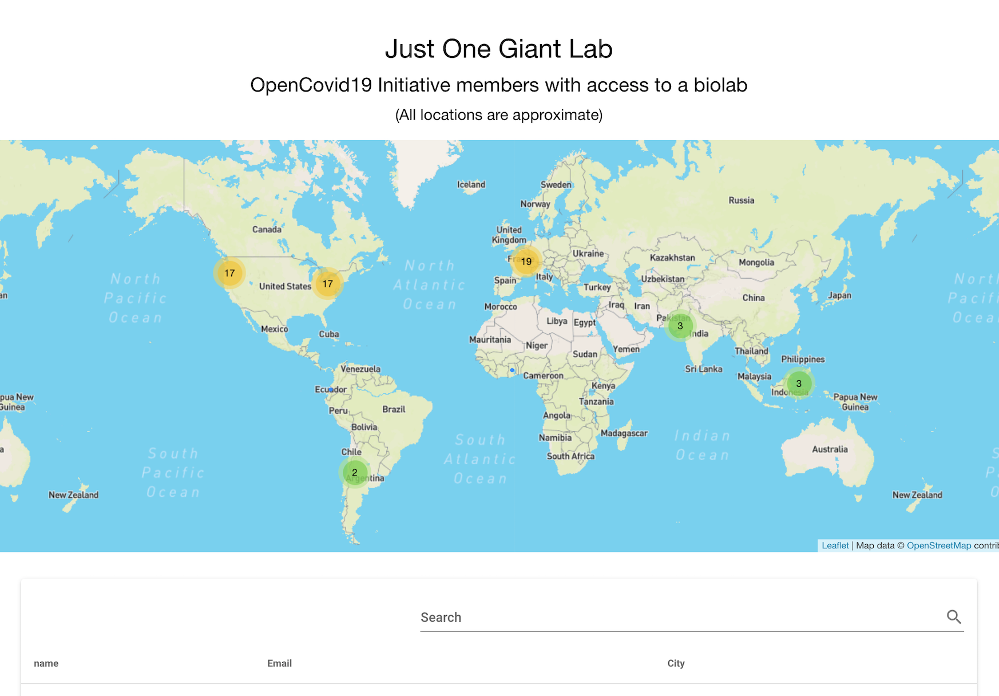

# JOGL OpenCovid19 Biolab Map

Interactive map of biolabs available to members of [Just One Giant Lab's OpenCovid19 Initiative](https://app.jogl.io/project/118?)

https://jogl-opencovid19-jancvanb.web.app/



## Known issues

- The dots/circles do not always appear on the map.
    - This is due to high-frequency OpenCage API calls exceeding the API key's daily quota.
    - The OpenCage API responses should be cached in the Google Sheet to eliminate the danger of end users exceeding that quota.

## Tools used

- [Google Sheets API](https://developers.google.com/sheets/api/quickstart/js)
- [OpenCage Geocoding API](https://opencagedata.com/api)
- [DataMaps](http://datamaps.github.io/)

## Developer setup

- Install [the Firebase CLI](https://github.com/firebase/firebase-tools)

## How to deploy updates

```sh
firebase deploy
```

(This assumes you have permission to deploy to the existing Firebase project. If you want to deploy to a different Firebase project, edit the `.firebaserc` file.)
