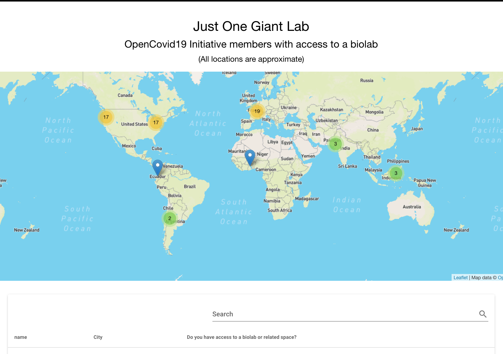

# JOGL OpenCovid19 Biolab Map

Interactive map of biolabs available to members of [Just One Giant Lab's OpenCovid19 Initiative](https://app.jogl.io/project/118?)

https://jogl-opencovid19-jancvanb.web.app/



## Tools used

- [Google Sheets API](https://developers.google.com/sheets/api/quickstart/js)
- [Nominatim](https://wiki.openstreetmap.org/wiki/Nominatim)
- [Leaflet](https://leafletjs.com/)
- [Vuetify](https://vuetifyjs.com/en/)
- [Firebase Hosting](https://firebase.google.com/docs/hosting)

## Developer setup

- Install [the Firebase CLI](https://github.com/firebase/firebase-tools)

## How to deploy updates

```sh
firebase deploy
```

(This assumes you have permission to deploy to the existing Firebase project. If you want to deploy to a different Firebase project, edit the `.firebaserc` file.)
